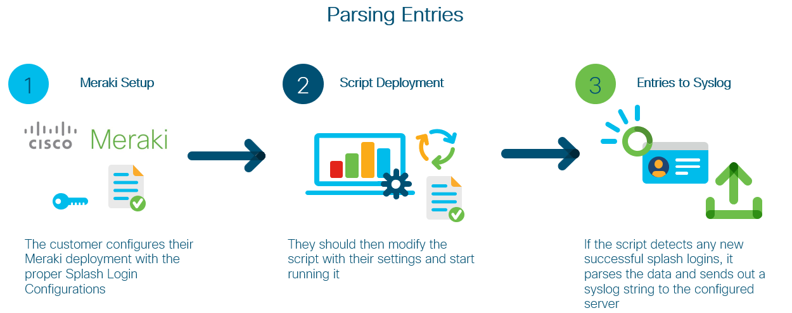

# Meraki Syslog Parser

This is the Meraki Splash Login Syslog Parser source code. This allows us to capture successful authentications 
on Meraki Splash Logins and parse these into syslog entries. These can then be formatted and sent to a
Syslog Server for further processing or to be used for further actions.


### High Level Design


## Contacts

* Josh Ingeniero (jingenie@cisco.com)
* Monica Acosta (moacosta@cisco.com)
* Derrick Pin Hon Low (delow@cisco.com)

## Solution Components
* Meraki Dashboard API's
* Meraki MR Wireless Access Points
* Python
* Syslog Receiver

## Installation:

#### Clone the repo
```console
git clone https://www.github.com/gve-sw/GVE_Devnet_Meraki_Syslog_Parser
```

#### Set up a Python venv
First make sure that you have Python 3 installed on your machine. We will then be using venv to create
an isolated environment with only the necessary packages.

##### Install virtualenv via pip
```
$ pip install virtualenv
```

##### Create a new venv
```
Change to your project folder
$ cd GVE_Devnet_Meraki_Syslog_Parser

Create the venv
$ virtualenv venv

Activate your venv
$ source venv/bin/activate
```

#### Install dependencies
```
$ pip install -r requirements.txt
```

## Setup:
#### Meraki details:
You can deploy this prototype in a lab environment or on your own Meraki dashboard online
[here](https://account.meraki.com/secure/login/dashboard_login).

To generate an API KEY, refer to the documentation [here](https://documentation.meraki.com/zGeneral_Administration/Other_Topics/The_Cisco_Meraki_Dashboard_API#Enable_API_access).
You will use this for getting an ORGANIZATION ID, and using this application.

You must select an organization to manage and use its ORGANIZATION ID. You may do so by using Meraki's Postman collection
[here](https://documenter.getpostman.com/view/7928889/SVmsVg6K#18e62fd9-402a-4768-ab5e-f11a44651cfe) and GET the list of organizations,
or use Meraki's API Docs to generate a request [here](https://developer.cisco.com/meraki/api-v1/#!get-organizations).
Then you should select the appropriate network and use its NETWORK ID [here](https://developer.cisco.com/meraki/api-v1/#!get-organization-networks)

Fill in the details of your Meraki deployment in the [main.py](main.py) file
```python

API_KEY = "API_KEY"
NETWORK_ID = "NETWORK_ID"

```

#### Script Customisation:
You may change the options in the [main.py](main.py) file
```python
# Syslog Server Details
ADDRESS = '127.0.0.1'
PORT = 514

# Best to keep LOOKBACK * 2 INTERVAL or higher
LOOKBACK = 20
INTERVAL = LOOKBACK / 2
```


## Usage:

### Python
Run the script for testing
```
$ cd splash-syslog
$ python main.py
```

Run the sample syslog server for testing
```
$ cd syslog-server-test
$ python pysyslog.py
```

### Logging
Functions are being logged in the [app.log](/splash-syslog/app.log) file.


### Syslog Entry Structure
You may modify this in the ```info_list``` variable in the  ```send_to_syslog``` function
```json
{
	"name": "Test Test",
	"login": "test@testemail.net",
	"ssid": "Hello Test",
	"loginAt": "2021-03-03T09:35:35.000000Z",
	"gatewayDeviceMac": "96:38:48:ad:05:5e",
	"clientMac": "ac:5f:4e:56:3f:17",
	"clientId": "k6279b8",
	"authorization": "success"
}
```


## License
Provided under Cisco Sample Code License, for details see [LICENSE](./LICENSE.txt)

## Code of Conduct
Our code of conduct is available [here](./CODE_OF_CONDUCT.md)

## Contributing
See our contributing guidelines [here](./CONTRIBUTING.md)


#### DISCLAIMER:
<b>Please note:</b> This script is meant for demo purposes only. All tools/ scripts in this repo are released for use "AS IS" without any warranties of any kind, including, but not limited to their installation, use, or performance. Any use of these scripts and tools is at your own risk. There is no guarantee that they have been through thorough testing in a comparable environment and we are not responsible for any damage or data loss incurred with their use.
You are responsible for reviewing and testing any scripts you run thoroughly before use in any non-testing environment.